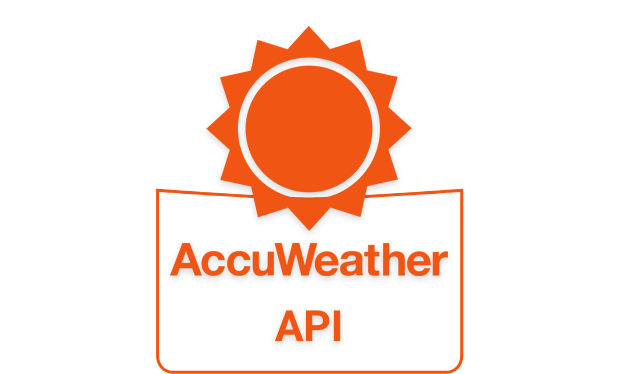

# AccuWeather.com Web-App Client

__Hosted__, at this [**Link**](http://)



## Overview

Bootstrapped with 'create-react-app' script:

```bash
npx create-react-app <app-name> --template typescript
```

Web-App client for AccuWeather.com public API, allowing for weather results based on city name queries.
results are based on AccuWeather's free public API, for further details please see [here](https://developer.accuweather.com).

- __Tech-Stack__
  - [TypeScript](https://www.typescriptlang.org)
  - [React.js](https://reactjs.org)
  - [Redux](https://redux.js.org)
  - [Redux-Saga](https://redux-saga.js.org)
  - [Axios](https://github.com/axios/axios)
  - [Redis](https://redis.io)

- __Implemented AccuWeather API's__
  - Autocomplete search
  - Current Conditions
  - 5 Days of Daily Forecasts
  
